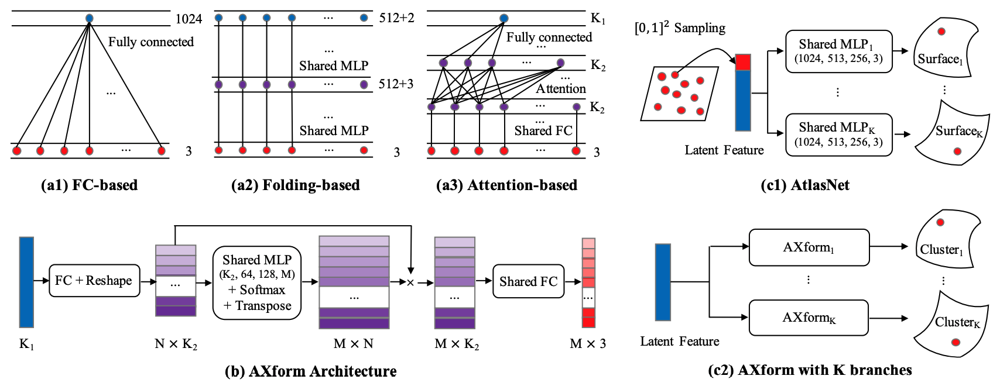

# Attention-based Transformation from Latent Features to Point Clouds



This repository contains a PyTorch implementation of the paper:

[Attention-based Transformation from Latent Features to Point Clouds](https://arxiv.org/abs/2112.05324)
<br>
[Kaiyi Zhang](https://kaiyizhang.github.io/),
[Ximing Yang](https://symenyang.github.io/),
Yuan Wu,
[Cheng Jin](https://cs.fudan.edu.cn/3f/b7/c25893a278455/page.htm/)
<br>
AAAI 2022

## Introduction

In point cloud generation and completion, previous methods for transforming latent features to point clouds are generally based on fully connected layers (FC-based) or folding operations (Folding-based). However, point clouds generated by FC-based methods are usually troubled by outliers and rough surfaces. For folding-based methods, their data flow is large, convergence speed is slow, and they are also hard to handle the generation of non-smooth surfaces. In this work, we propose AXform, an attention-based method to transform latent features to point clouds. AXform first generates points in an interim space, using a fully connected layer. These interim points are then aggregated to generate the target point cloud. AXform takes both parameter sharing and data flow into account, which makes it has fewer outliers, fewer network parameters, and a faster convergence speed. The points generated by AXform do not have the strong 2-manifold constraint, which improves the generation of non-smooth surfaces. When AXform is expanded to multiple branches for local generations, the centripetal constraint makes it has properties of self-clustering and space consistency, which further enables unsupervised semantic segmentation. We also adopt this scheme and design AXformNet for point cloud completion. Considerable experiments on different datasets show that our methods achieve state-of-the-art results.

## Dependencies

- Python 3.6
- CUDA 10.0
- G++ or GCC 7.5
- [PyTorch](https://pytorch.org/). Codes are tested with version 1.6.0
- (Optional) [Visdom](https://github.com/fossasia/visdom/) for visualization of the training process

Install all the following tools based on CUDA.
```bash
cd utils/furthestPointSampling
python3 setup.py install

# https://github.com/stevenygd/PointFlow/tree/master/metrics
cd utils/metrics/pytorch_structural_losses
make

# https://github.com/sshaoshuai/Pointnet2.PyTorch
cd utils/Pointnet2.PyTorch/pointnet2
python3 setup.py install

# https://github.com/daerduoCarey/PyTorchEMD
cd utils/PyTorchEMD
python3 setup.py install

# not used
cd utils/randPartial
python3 setup.py install
```

## Datasets

PCN dataset ([Google Drive](https://drive.google.com/file/d/1Wd-aJPxrSXrUBrXG5Fi7it71Cqn8Xydt/view?usp=sharing)) are used for point cloud completion. 

ShapeNetCore.v2.PC2048 ([Google Drive](https://drive.google.com/file/d/11PZzFtWTY5jtB-2g_Z1QyWSC5CJIqzAv/view?usp=sharing)) are used for the other tasks. The point clouds are uniformly sampled from the meshes in ShapeNetCore dataset (version 2). All the point clouds are centered and scaled to [-0.5, 0.5]. We follow the official split. The sample code based on [PyTorch3D](https://pytorch3d.org/) can be found in `utils/sample_pytorch3d.py`.

Please download them to the `data` directory.

## Training

All the arguments, e.g. `gpu_ids`, `mode`, `method`, `hparas`, `num_branch`, `class_choice`, `visual`, can be adjusted before training. For example:

```bash
# axform, airplane category, 16 branches
python3 axform.py --mode train --num_branch 16 --class_choice ['airplane']

# fc-based, car category
python3 models/fc_folding.py --mode train --method fc-based --class_choice ['car']

# l-gan, airplane category, not use axform
python3 models/latent_3d_points/l-gan.py --mode train --method original --class_choice ['airplane'] --ae_ckpt_path path_to_ckpt_autoencoder.pth

# axformnet, all categories, integrated
python3 axformnet.py --mode train --method integrated --class_choice None
```

## Pre-trained models

Here we provide pre-trained models ([Google Drive](https://drive.google.com/file/d/1oCjAEtFGzEAFC9j9meGg9FI3rHpdOyXM/view?usp=sharing)) for point cloud completion. The following is the suggested way to evaluate the performance of the pre-trained models.

```bash
# vanilla
python3 axformnet.py --mode test --method vanilla --ckpt_path path_to_ckpt_vanilla.pth

# integrated
python3 axformnet.py --mode test --method integrated --ckpt_path path_to_ckpt_integrated.pth
```

## Visualization

[Matplotlib](https://matplotlib.org/) is used for the visualization of results in the paper. Code for reference can be seen in `utils/draw.py`.

Here we recommend using [Mitsuba 2](https://www.mitsuba-renderer.org/) for visualization. An example code can be found in [Point Cloud Renderer](https://github.com/zekunhao1995/PointFlowRenderer/).

## Citation

Please cite our work if you find it useful:
```latex
@article{zhang2021axform,
 title={Attention-based Transformation from Latent Features to Point Clouds},
 author={Zhang, Kaiyi and Yang, Ximing, and Wu, Yuan and Jin, Cheng},
 journal={arXiv preprint arXiv:2112.05324},
 year={2021}
}
```

## License

This project Code is released under the MIT License (refer to the LICENSE file for details).